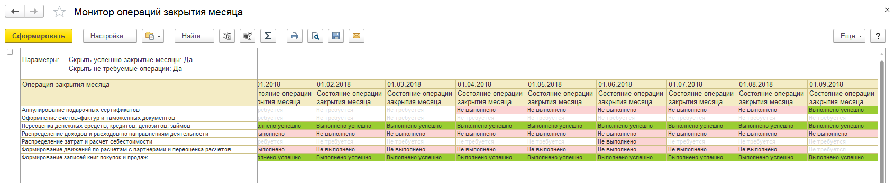

# Монитор операций закрытия месяца для УТ/КА/УП

Контроль операций закрытия месяца по разным этапам с начала ведения учета в программе.
Позволяет найти проблемный месяц и проблемный этап закрытия и перейти к закрытию месяца.

## Анонс

Как часто, приходя к клиенту вы видите ужас и мрак с закрытием месяцев?
Как долго нужно проматывать список месяцев чтобы наконец найти тот самый проблемный месяц и его закрыть?
Всегда хочется иметь актуальную информацию обо всех операциях закрытия месяца.

## Функциональность

```

Дано: 
    Конфигурация УТ/КА/УП поколения *.4.5.* или выше
Сценарий:
    Я как специалист, выполняющий регулярное закрытие месяца
    Хочу увидеть состояние выполненных операций закрытия месяца в разрезе месяцев
    И когда я расшифровываю значение состояния я хочу быстро перейти к закрытию месяца,
        соответствующего проблеме
    И я хочу иметь возможность исключать полностью закрытые месяцы
    И я хочу иметь возможность исключать операции закрытия месяца,
        по которым не требовались действия за весь период ведения учета в программе.

```



Об особеностях реализации и идеях, используемых при создании расширения, читайте на [Infostart: Монитор операций закрытия месяца для УТ/КА/УП, как правильно создать расширение](https://infostart.ru/public/904943/)